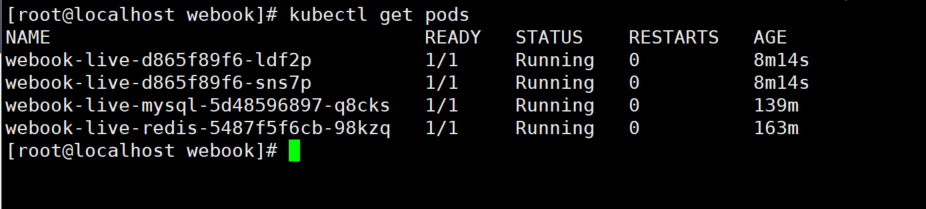

## 作业：修改已有的部署方案

- 将 webook 的启动端口修改 8081。
- 将 webook 修改为部署 2 个 Pod。
- 将 webook 访问 Redis 的端口修改为 6380。
- 将 webook 访问 MySQL 的端口修改为 3308。

你需要提供：

- kubectl get services 的截图。
- kubectl get pods 的截图。
- 你通过浏览器访问 webook，能够正确得到响应的截图。

截图如下:

1.kubectl get services 的截图

2.kubectl get pods 的截图，截图如下

3.注册响应截图

